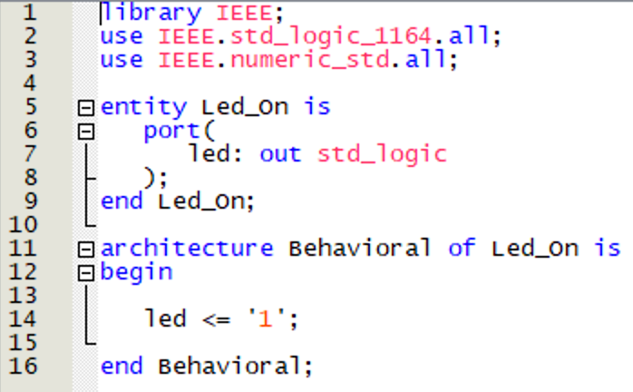
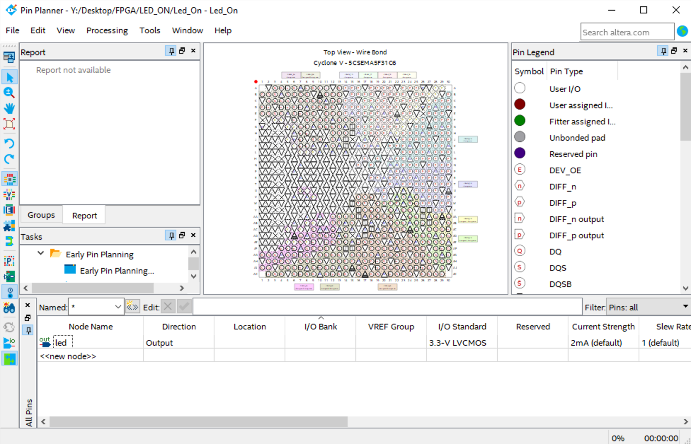
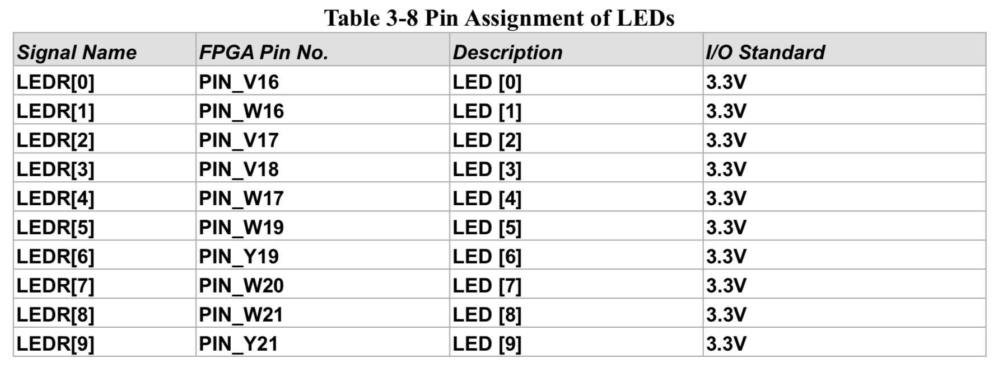
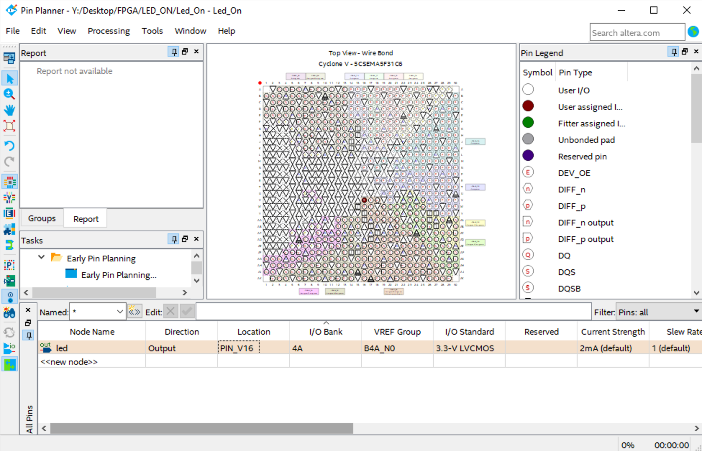
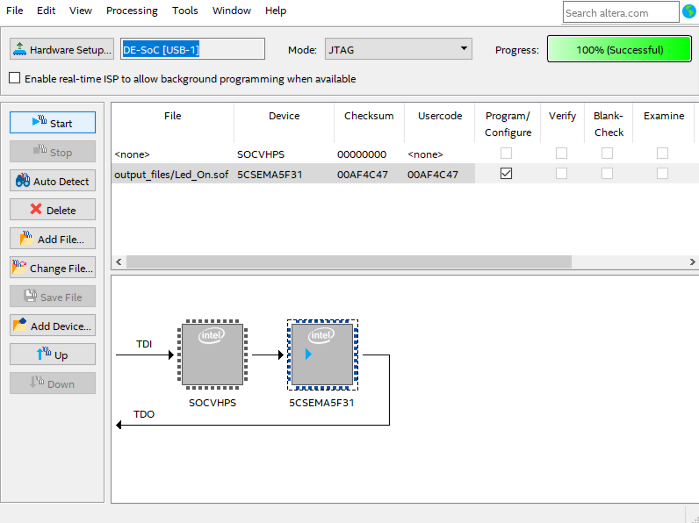
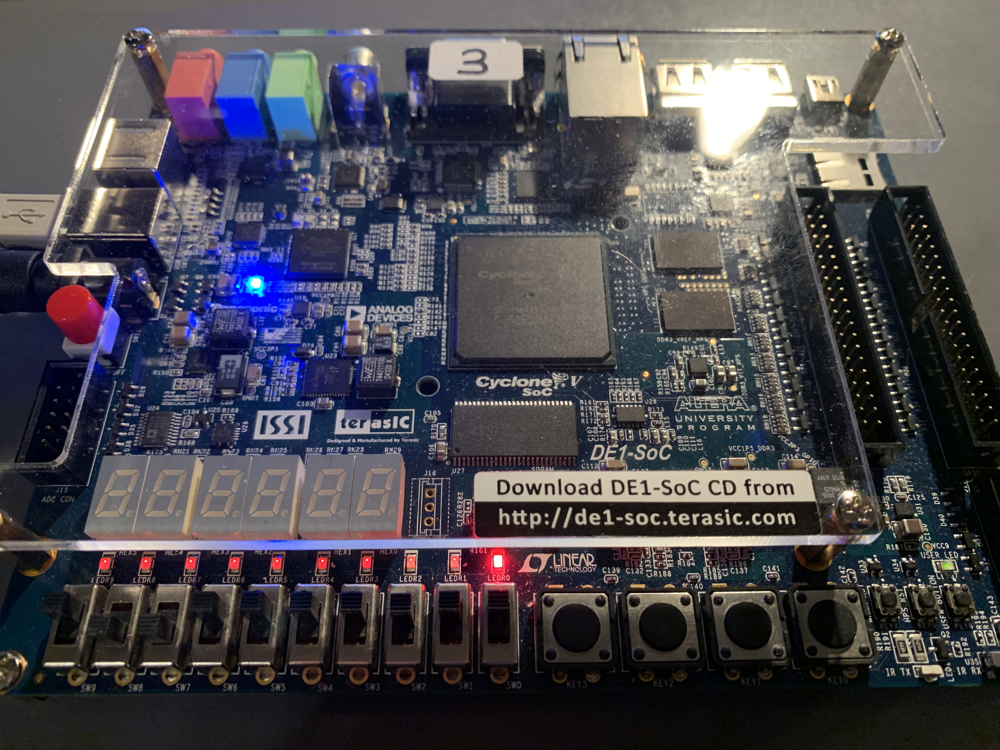

# 1 - LED ON
In this folder, you can find how a LED on the DE1-SOC board is used.

## VHDL Code

It is just continuously set logic 1 (3.3 V) to led signal. If we assign led signal to board's LED pin, then we see a working led on the board.

## Pin Planner
### Where is the Pin Planner?
In Quartus, you can find the pin planner button on the toolbar.

If we ready to load our code to the board, the first step that we have to finish is pin planning. In this step, we will assign in and out pins of our entity (Led_On). 
You have to see an empty window like the figure below.

To make proper asssignment, we must look at the board documentation. In documentation, we can find the table that is shown below.

Now, we know the correct pin(PIN_V16) to assign. Planning is finished as in the figure shown below.

## Programming DE1-SOC board.
Programming step is not complicated. 

1. Open the Programmer window.
2. Press Auto-Detect.
3. Check Program/Configure box of 5CSEMA FPGA chip.
4. Press Start to load the code.

After programming is finished, you have to see a window like the figure is shown below. 

## Results
Finally, we can put the :blush: on our faces. 

You can think all the leds is working but just LED0 is working. This happens when you don't assign the led. (Neither logic-1 nor logic-0)

