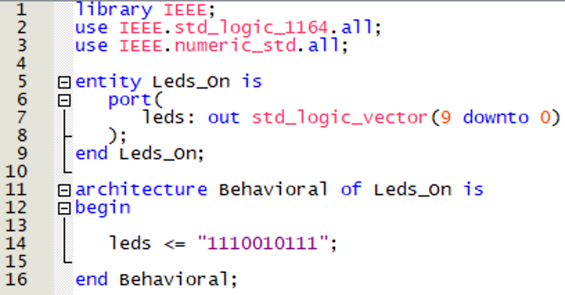
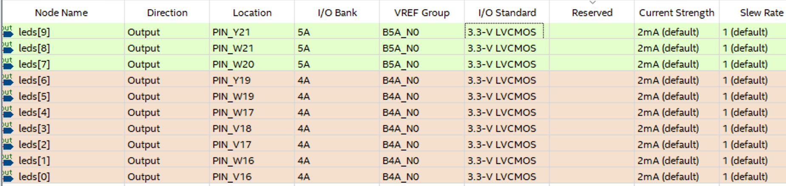
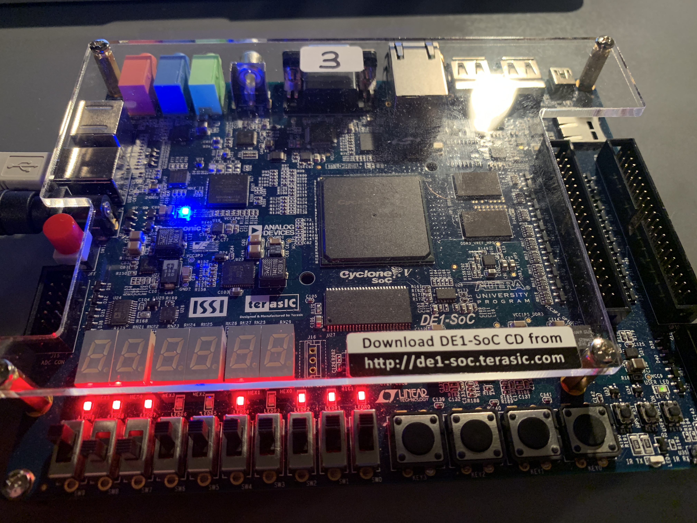

# 2 - LEDS ON
In this folder, you can find how the LEDS on the DE1-SOC board is used.

## VHDL Code

It is just continuously set logic 1 (3.3 V) or logic 0 (0 V) to leds signal. If we assign leds signal to board's LED pin, then we see the working leds on the board.
I have already explained the all steps in the [1-LED_ON](../1-LED_ON) project. Therefore, I will just share the important images from some steps.

## Pin Planner

## Results
Finally, we can put the :blush: on our faces. 

Now all the leds is working properly as it is seen in the figure above (There is no unexpected states (Neither Logic-1 nor logic-0))
